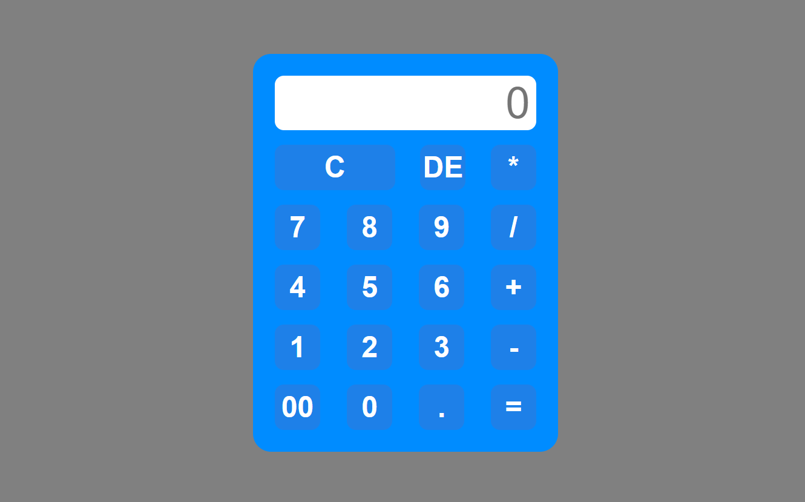

# CALCULATOR

A basic calculator to perform basic mathematical operations.

## Table of contents

- [Screenshot](#screenshot)
- [Links](#links)
- [Built with](#built-with)

# Screenshot

# Links

- github URL: https://github.com/MercySitienei/codsoft_3.git
- Live Site URL: https://mercysitienei.github.io/codsoft_3/

# Built with

- Semantic HTML5 markup
- CSS custom properties
- Flexbox
- CSS Grid
- Mobile-first workflow
- JavaScript
